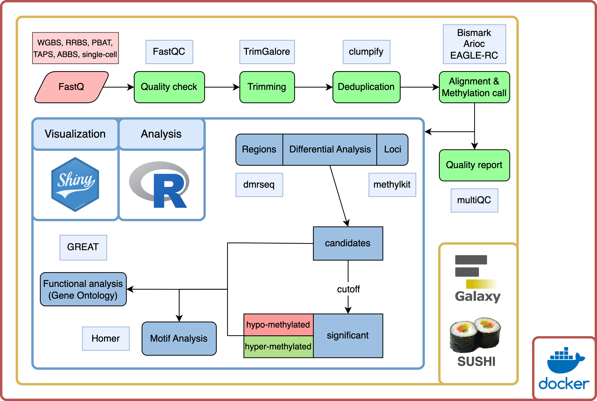
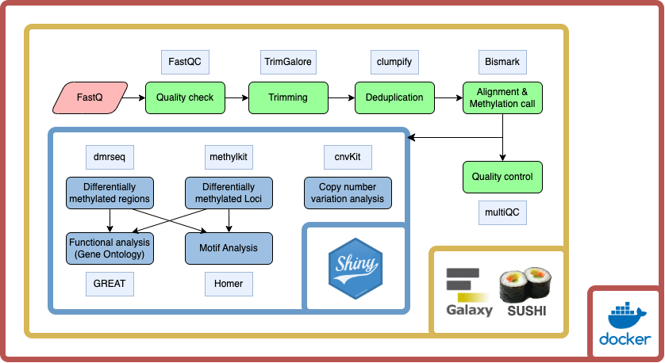
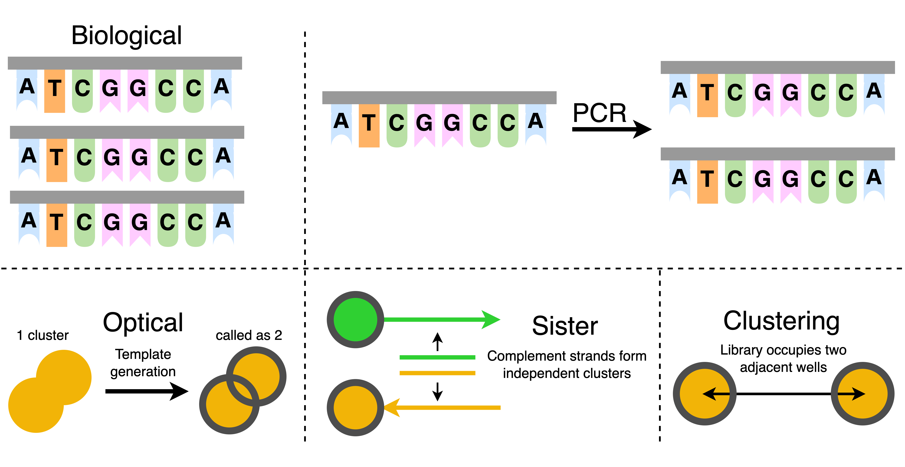
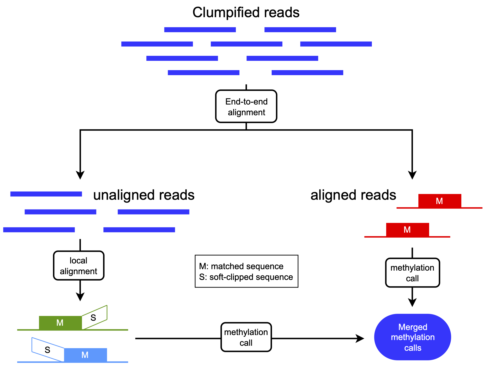
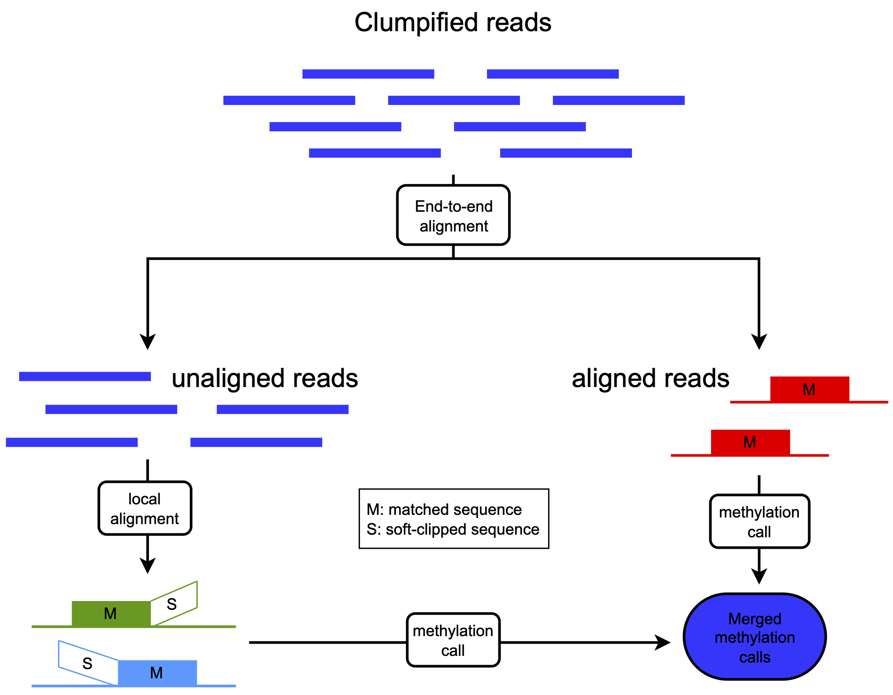
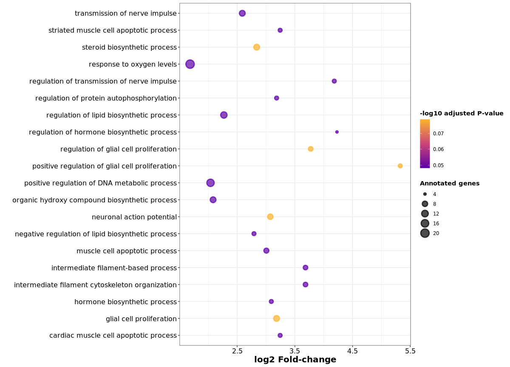
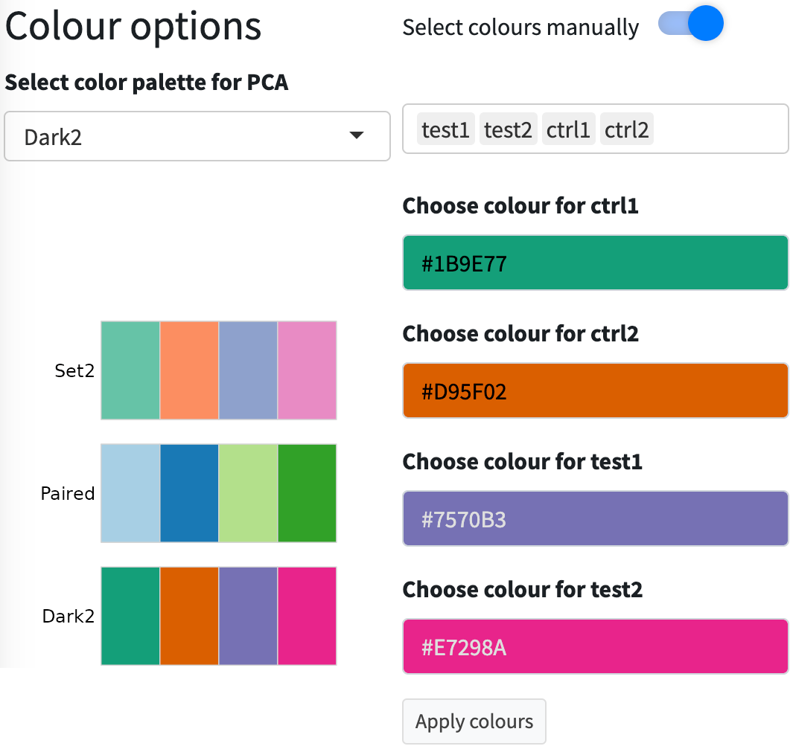

<style>
.mybreak {
   break-before: column;
}
</style>

<style>
.ref-align {
  text-align: left
}
</style>

<style>
img {
  display: block;
  margin-top: -7px; /* Adjust this value as needed */
}

.my-image {
  margin-top: -1px; /* Adjusted value for a specific image */
}
</style>

<style type="text/css">
    .brsmall {
        display: block;
        margin-bottom: .3em;
    }
    .brxsmall {
        display: block;
        margin-bottom: .4em;
    }
    .brsmallneg {
        display: block;
        margin-bottom: -.4em;
        margin-left: auto;
        margin-right: auto;
        text-align: center;
    }
    .brconclusion {
        display: block;
        margin-bottom: .8em;
    }
</style>


```{css, echo=FALSE}
div.logo_left{
  width: 15%;
}
div.poster_title{
  width: 70%;
}
```


```{r, include=FALSE}
knitr::opts_chunk$set(echo = FALSE,
                      warning = FALSE,
                      tidy = FALSE,
                      message = FALSE,
                      fig.align = 'center',
                      strip.white = T,
                      out.width = "100%",
                      fig.show='asis')
options(knitr.table.format = "html") 
library("knitr")
library("readxl")
library("kableExtra")
library(stringr)
# library(EML)
```

```{r, include=FALSE}
knitr::write_bib(c('posterdown', 'rmarkdown','pagedown'), 'packages.bib')
```


```{r, include=FALSE}
library(stringr)
fix_wrap_kable <- function(kbl) {

  kbl <- kbl %>% 
    str_remove(paste0("\\\\caption[{].+[}]\\n")) %>% # Removes the first caption
    str_replace("\\\\end[{]tabular[}]",
                paste0("\\\\end{tabular}\n\\\\caption{",attributes(kbl)$kable_meta$caption %>% # Adds the new caption using the string supplied in the kable 'caption' argument.
                # The '{0,100}' is just a hack around lookbehind needing a set length, so the function will not work if the table label is longer 
                         str_replace("(?<=[(]\\\\#.{0,100})[)]","}") %>% # Fixes and issue with pandoc syntax being mixed with LaTeX 
                         str_replace("\\label[{]|[(]\\\\#","\\\\\\\\label{"),"}\n")) %>% # Adds an appropriate amount of backslashes before "\label"
    set_attributes(attributes(kbl)) # Ensures that the returned object is still a kable
  
  attributes(kbl)$kable_meta$caption <- NA # Removes the caption from the metadata
  
  return(kbl)
}
```


# Introduction
   
DNA cytosine methylation is the addition of a methyl group to a cytosine in the DNA. It impacts transcription and therefore plays a major role in several vital processes. In mammals, DNA cytosine methylation predominantly occurs in CG sequence contexts. In plants, in addition to the CG context, the CHG and CHH contexts are common as well.

<figure>
<center>
  
  <br>
  <figcaption><b>Figure 1:</b> Methylation contexts in mammals and plants.</figcaption>
</center>
</figure>
</b>

```{r methylationcontexts, include=F, fig.cap="Methylation contexts in mammals and plants.", out.width="80%"}
# knitr::opts_chunk$set(echo = FALSE,
#                       warning = FALSE,
#                       tidy = FALSE,
#                       message = FALSE,
#                       fig.align = 'center',
#                       out.width = "60%")

```

Various tools have been introduced to facilitate the analysis of DNA cytosine methylation data. Usually, they focus on a small part of the workflow, which still leaves users with a considerable amount of work to evaluate appropriate tools, transform intermediate output, and finally generate publication-ready figures. Additionally, many tools are limited in terms of the input data, only providing support for certain species and/or specific library preparation methods.

# Pipeline overview
Here we introduce Methylator, a user-friendly tool for a full DNA cytosine methylation analysis, with an easy-to-use interface, facilitated reproducibility and interactive visualizations of results.
<!-- <div style="line-height:30%; visibility:hidden;"> -->
<!--     <br> -->
<!-- </div> -->

<!-- <figure> -->
<!-- <center> -->
<!--    -->
<!--   <br> -->
<!--   <figcaption><b>Figure 2:</b> Overview of Methylator.</figcaption> -->
<!-- </center> -->
<!-- </figure> -->
<!-- </b> -->

<figure>
<center>
  
  <br>
  <figcaption><b>Figure 2:</b> Overview of Methylator.</figcaption>
</center>
</figure>
</b>

```{r workflow, include=F, fig.cap='Pipeline overview with the respective tools used in each step.', class.source = "my.image"}
# knitr::opts_chunk$set(echo = FALSE,
#                       warning = FALSE,
#                       tidy = FALSE,
#                       message = FALSE,
#                       fig.align = 'center',
#                       out.width = "100%")
# 


```

## Galaxy

Galaxy is an open-source, web-based platform for accessible, reproducible, and transparent computational biomedical research. It provides a user-friendly interface for executing complex bioinformatics tools and workflows without requiring programming expertise. Galaxy enables researchers to upload their data, run analyses using a vast array of tools, and share their entire analytical workflow with others. This approach not only facilitates collaboration but also enhances the reproducibility of scientific findings.

<figure>
<center>
  
  <br>
  <figcaption><b>Figure 3:</b> Simplified Galaxy Worfklow.</figcaption>
</center>
</figure>
</b>

# Duplicate removal

Although technical duplicate reads can arise from different sources, most deduplication tools focus on PCR duplicates. Clumpify can deal with the different types of duplication in the sequencing data, such as optical duplicates. As the abundance of the types of duplicates in the data depends on the sequencing technology used, Methylator adapts the duplication removal accordingly to the user input.

## Types of duplicates in sequencing data {.mybreak}
<!-- <figure> -->
<!-- <center> -->
<!--    -->
<!--   <br> -->
<!--   <figcaption><b>Figure 3:</b> Types of duplicates that can be present after sequencing. Adapted from [biostars.org/p/229842/](biostars.org/p/229842/) </figcaption> -->
<!-- </center> -->
<!-- </figure> -->
<!-- </b> -->

<figure>
<center>
  
  <br>
  <figcaption><b>Figure 3:</b> Types of duplicates that can be present after sequencing. Adapted from [biostars.org/p/229842/](biostars.org/p/229842/) </figcaption>
</center>
</figure>
</b>

```{r, duplicates, include=F, fig.cap='Types of duplicates present after sequencing.'}
knitr::include_graphics("figures/duplicates_final.drawio.png")
```

# Alignment
Bisulfite treatment of DNA results in a decreased sequence complexity, which deteriorates mapping efficiency. Overall, this causes loss of a big proportion of the sequencing data for analysis.

## Dirty Harry method
The Dirty Harry method offers an improvement to the mapping rate by remapping the unaligned reads locally.
Through that, this method increases the mapping efficiency and retains a considerable amount of cytosine sites, which would otherwise be lost.


<figure>
<center>
  
  <br>
  <figcaption><b>Figure 4:</b> Dirty Harry alignment method. Adapted from @Wu2019 </figcaption>
</center>
</figure>
</b>

```{r, dirtyharry, include=F, fig.cap='Dirty harry method for alignment. Adapted from [https://academic.oup.com/bioinformatics/article/35/18/3273/5341422?login=true]'}

```

# Visualization

For each type of analysis, several outputs are generated and visualized in a stand-alone interactive shiny app. 
Publication-ready figures are created using recommended colourblind-friendly palettes. Each plot can be customized and downloaded individually by the user.

<!-- # ```{r, shiny_1, fig.show="hold", out.width="20%", fig.cap='Colour option example for a PCA plot in...'} -->
<!-- #  -->
<!-- # knitr::include_graphics("figures/dotPlot.png") -->
<!-- # ``` -->

<!-- <figure> -->
<!-- <center> -->
<!--    -->
<!--   <br> -->
<!--   <figcaption><b>Figure 5:</b> Enrichment table.</figcaption> -->
<!-- </center> -->
<!-- </figure> -->
<!-- </b> -->

<figure>
<center>
  
  <br>
  <figcaption><b>Figure 6:</b> Dot plot of biological processes enrichment.</figcaption>
</center>
</figure>
</b>

<figure>
<center>
  
  <br>
  <figcaption><b>Figure 7:</b> Volcano plot of genomic regions enrichment.</figcaption>
</center>
</figure>
</b>

## <span class="brsmallneg"></span> Visual customization
<figure>
<center>
  
  <br>
  <figcaption><b>Figure 8:</b> Colour customization of figures.</figcaption>
</center>
</figure>
</b>

<!-- Dot plot of enrichment of genes in biological processes. -->
<!-- Example of colour options for plotting, with pre-defined colourblind-friendly palettes and manual input. -->

<!--  -->
<!--  -->

<!-- <figure> -->
<!-- <center> -->
<!--    -->
<!--   <br> -->
<!--   <figcaption><b>Figure 6:</b> Enrichment Table.</figcaption> -->
<!-- </center> -->
<!-- </figure> -->
<!-- </b> -->

<!--  -->

# Comparison with other tools

<style>
.table>tbody>tr>td{
  padding: 1px; border: hidden;
}
</style>


```{r toolcomparisontable, fig.cap="Comparison to features of popular tools. GUI = graphical user interface. CLI = command line interface. DMR/DML/DMG = Differentially Methylated Regions/Loci/Genes. GO = Gene Ontology"}
# knitr::opts_chunk$set(echo = FALSE,
#                       warning = FALSE,
#                       tidy = FALSE,
#                       message = FALSE,
#                       fig.align = 'center',
#                       out.width = "40%")

# tool_comparison_table <- read_xlsx("figures/Pipelines_comparison.xlsx", sheet = 2)
tool_comparison_table <- read.csv("figures/Pipelines_comparison_09092024.csv")


# colnames(tool_comparison_table)[1] <- ""
tool_comparison_table <- data.frame(lapply(tool_comparison_table, gsub, pattern = "\\<T\\>", replacement = "<h3>&#10003; </h3>"))
tool_comparison_table <- data.frame(lapply(tool_comparison_table, gsub, pattern = "\\<F\\>", replacement = "<h3>&#10005; </h3>"))
# tool_comparison_table <- data.frame(lapply(tool_comparison_table, gsub, pattern = "\\<T\\>", replacement = '\\checkmark'))
# tool_comparison_table <- data.frame(lapply(tool_comparison_table, gsub, pattern = "\\<F\\>", replacement = '\\checkmark'))

# colnames(tool_comparison_table)[1] <- ""
rownames(tool_comparison_table) <- tool_comparison_table[,1]
tool_comparison_table <- tool_comparison_table[,-1]
colnames(tool_comparison_table)[2] <- "methylseq"
colnames(tool_comparison_table)[5] <- "MethylC-analyzer"
# colnames(tool_comparison_table)[1] <- "<b>Methylator</b>"
tool_comparison_table["Copy number variation analysis", "Methylator"] <- "CNVkit"
# tool_comparison_table[13,1] <- "GO, KEGG, Reactome, user-defined"
tool_comparison_table[4,1] <- "WGBS, RRBS, PBAT, TAPS, ABBS, single-cell"

# stripe_color
# stripe_index

knitr::kable(
  tool_comparison_table, format = "html",
  # caption = "Comparison to features of popular tools. GUI = graphical user interface. CLI = command line interface. DMR/DML/DMG = Differentially Methylated Regions/Loci/Genes. GO = Gene Ontology",
  # caption = "",
  align = "c",
  # booktabs = T,
  escape = FALSE) %>%
  kable_styling(
    # bootstrap_options = c("striped", "condensed"),
    # bootstrap_options = c("condensed", "bordered"),
    font_size = 23
  ) %>%
  row_spec(0, bold = T, extra_css = "border-bottom: 0px solid") %>%
  row_spec(seq(1,nrow(tool_comparison_table),2), background="#CCE5FF") %>%
  # row_spec(16, extra_css = "border-bottom: 3px solid") %>%

  # row_spec(1:nrow(tool_comparison_table), extra_css = "..") %>%
  # row_spec(seq(0,nrow(tool_comparison_table),2), background="#CCE5FF") %>%
  column_spec(1, bold = T)
  # row_spec(16, extra_css = "border-bottom: 3px solid") %>%
  # fix_wrap_kable
  # footnote(general_title = "
  # 
  #          **Table 1:** Comparison with features of popular tools.",
  # general = "GUI = graphical user interface
  #          CLI = command line interface
  #          DMR/DML/DMG = Differentially Methylated Regions/Loci/Genes
  #          GO = Gene Ontology",
  # title_format = "bold")

# knitr::kable(
#   tool_comparison_table, format = "latex",
#   caption = "Comparison to features of common tools. DMRs = Differentially Methylated Regions,
#   DMLs = Differentially Methylated Loci, DMGs = Differentially Methylated Genes",
#   align = "c",
#   escape = FALSE) %>%
#   kable_styling(
#     font_size = 20
#     ) %>%
#   column_spec(1, bold = TRUE)
```

&emsp;&emsp;&emsp;&emsp;&emsp;&nbsp;<b>Table 1:</b> Comparison with features of widely used tools.<br>

<!-- <b>Table 1:</b> Comparison with features of popular tools.<br><br> -->
GUI = graphical user interface, CLI = command line interface<br>
DMR/DML/DMG = Differentially Methylated Regions/Loci/Genes<br>
GO = Gene Ontology

<!-- <div style="line-height:30%; visibility:hidden;"> -->
<!--     <br> -->
<!-- </div> -->

# Conclusion

<!-- * User-friendly methylation analysis pipeline -->
<!-- * Support for plants & mammals -->
<!-- * Interactive visualizations -->
<!-- * Reproducibility through docker -->
## User-friendly, reproducible and sustainable DNA cytosine methylation data analysis pipeline<br><span class="brconclusion"></span>Support for plants & mammals<br><span class="brconclusion"></span>Can analyze methylation data from various library preparation methods for bulk sequencing <br><span class="brconclusion"></span>Interactive visualizations of results

# References {.ref-align}

